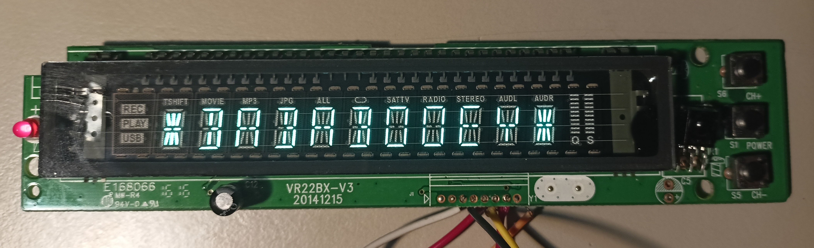
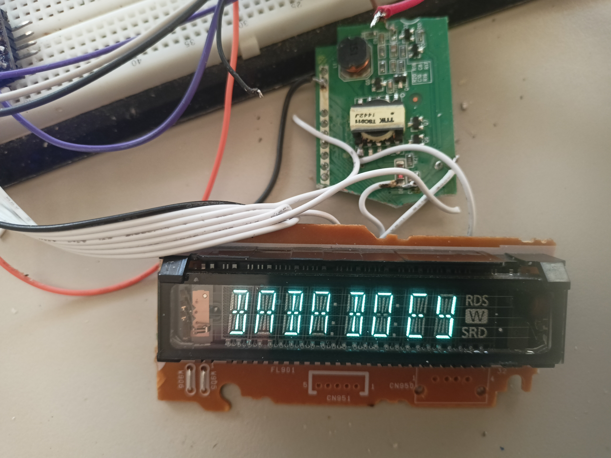
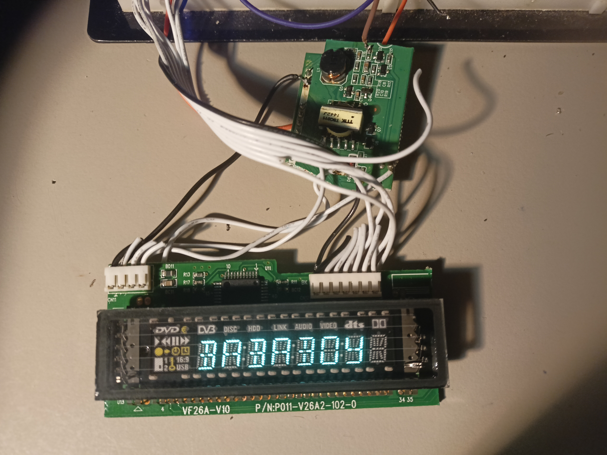

# stm8_pt6311
Universal stm8 library along with old library made only for specific display board - VR22BX-V3. Guide how to use this library is in header file - stm8_pt6311.h. It is currently version 1, so no keypad read is supported. I made this, because I think VFDs are awesome (they are like tiny oled displays :-))!
# Test images

PT6311

PT6315

Another PT6315 and there comes some problem with addressing, when trying to use rightmost digit, it shifts to left, needs to be fixed, happens among types with images on the left. Also you can notice missing dot in the middle, it is not 14 segment display, so I just skipped it!

